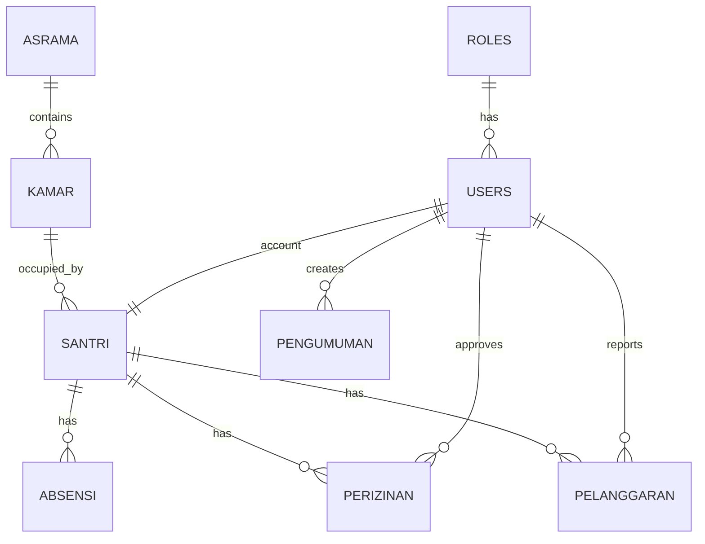

# Entity Relationship Diagram (ERD)

# SIPAS

Sistem Informasi Pondok Asrama Santri

---

# Overview

ERD ini menggambarkan hubungan antar tabel utama pada database SIPAS.

Database menggunakan PostgreSQL.

Versi:

1.0

---

# Main Tables

## roles

| Column | Type | Description |

|---------|------|-------------|

| id | bigint | Primary Key |

| name | varchar | Role Name |

| description | text | Role Description |

| created_at | timestamp | Created Time |

| updated_at | timestamp | Updated Time |

---

## users

| Column | Type | Description |

|---------|------|-------------|

| id | bigint | Primary Key |

| role_id | bigint | FK → [roles.id](http://roles.id) |

| username | varchar | Username |

| password | varchar | Password Hash |

| full_name | varchar | Full Name |

| email | varchar | Email |

| phone | varchar | Phone Number |

| is_active | boolean | Account Status |

| created_at | timestamp | Created Time |

| updated_at | timestamp | Updated Time |

---

## asrama

| Column | Type | Description |

|---------|------|-------------|

| id | bigint | Primary Key |

| name | varchar | Dormitory Name |

| gender | enum | Ikhwan / Akhwat |

| capacity | integer | Capacity |

| created_at | timestamp | Created Time |

| updated_at | timestamp | Updated Time |

---

## kamar

| Column | Type | Description |

|---------|------|-------------|

| id | bigint | Primary Key |

| asrama_id | bigint | FK → [asrama.id](http://asrama.id) |

| room_name | varchar | Room Name |

| capacity | integer | Capacity |

| created_at | timestamp | Created Time |

| updated_at | timestamp | Updated Time |

---

## santri

| Column | Type | Description |

|---------|------|-------------|

| id | bigint | Primary Key |

| user_id | bigint | FK → [users.id](http://users.id) |

| kamar_id | bigint | FK → [kamar.id](http://kamar.id) |

| nis | varchar | Student Number |

| full_name | varchar | Full Name |

| gender | enum | Ikhwan / Akhwat |

| birth_place | varchar | Birth Place |

| birth_date | date | Birth Date |

| address | text | Address |

| guardian_name | varchar | Parent / Guardian |

| guardian_phone | varchar | Guardian Phone |

| status | enum | Active / Alumni |

| created_at | timestamp | Created Time |

| updated_at | timestamp | Updated Time |

---

## absensi

| Column | Type | Description |

|---------|------|-------------|

| id | bigint | Primary Key |

| santri_id | bigint | FK → [santri.id](http://santri.id) |

| attendance_date | date | Attendance Date |

| attendance_time | time | Attendance Time |

| status | enum | Hadir / Izin / Alpha / Sakit |

| method | enum | Manual / QR / Face Recognition |

| created_at | timestamp | Created Time |

| updated_at | timestamp | Updated Time |

---

## perizinan

| Column | Type | Description |

|---------|------|-------------|

| id | bigint | Primary Key |

| santri_id | bigint | FK → [santri.id](http://santri.id) |

| permission_date | date | Date |

| reason | text | Reason |

| status | enum | Pending / Approved / Rejected |

| approved_by | bigint | FK → [users.id](http://users.id) |

| created_at | timestamp | Created Time |

| updated_at | timestamp | Updated Time |

---

## pelanggaran

| Column | Type | Description |

|---------|------|-------------|

| id | bigint | Primary Key |

| santri_id | bigint | FK → [santri.id](http://santri.id) |

| violation_type | varchar | Violation |

| point | integer | Point |

| note | text | Description |

| reported_by | bigint | FK → [users.id](http://users.id) |

| created_at | timestamp | Created Time |

| updated_at | timestamp | Updated Time |

---

## pengumuman

| Column | Type | Description |

|---------|------|-------------|

| id | bigint | Primary Key |

| user_id | bigint | FK → [users.id](http://users.id) |

| title | varchar | Announcement Title |

| content | text | Announcement Content |

| published_at | timestamp | Publish Date |

| created_at | timestamp | Created Time |

| updated_at | timestamp | Updated Time |

---

# Relationship

- One Role has many Users
- One Asrama has many Kamar
- One Kamar has many Santri
- One User can manage many Pengumuman
- One Santri has many Absensi
- One Santri has many Perizinan
- One Santri has many Pelanggaran

---

# Mermaid ER Diagram

---

# Future Development

Version 2.0

- QR Code Attendance
- Attendance Validation
- Attendance Recap
- Attendance Statistics

Version 3.0

- Face Recognition Attendance
- Multi-face Detection
- Real-time Camera Processing
- TV Camera Integration
- Automatic Attendance Recording
- Attendance Analytics

---

© 2026 SIPAS Project